# Flint

**A small x86-64 kernel, written in Rust, that boots to its own shell under QEMU.**

`no_std` · nightly rust · x86_64 · bootimage · serial console

Flint is a hobby kernel. I wrote it to find out what the hardware actually
requires between power and a prompt, because reading about it turned out to be
nothing like having to make it work.

The `bootloader` crate gets the CPU into long mode and hands over a memory map.
Everything after that is Flint's.

## What it does

- **Traps and descriptors.** A GDT with a TSS, an IDT with 256 vectors, and
  separate IST stacks for the faults that show up when the stack is already the
  problem.
- **Virtual memory.** Four-level paging, 4 KiB pages, one address space per
  process, the kernel mapped into every one of them.
- **Physical memory.** A frame allocator over the bootloader's memory map, with
  a linked-list kernel heap on top of it.
- **Processes.** Preemptive round-robin on a 100 Hz timer, one tick per
  quantum, `rsp` and `cr3` swapped on the way out.
- **Ring 3.** A syscall boundary that user code has to ask through for
  everything, including the ability to print a character.
- **A shell.** `help`, `ps`, `meminfo`, `exit`, over the serial line.
- **Tests.** Seven integration tests, each one booted under QEMU by
  `cargo test`.

## What it doesn't

No filesystem, no disk, no network, no SMP. No loader either: the shell is
compiled into the kernel image, so `ps` will never show you something you did
not build. One core, and everything it knows disappears when you type `exit`.

## Four commands

Prerequisites: the pinned `nightly` toolchain (`rust-toolchain.toml` fetches it
through `rustup`) with the `rust-src` and `llvm-tools` components,
`qemu-system-x86_64` (`apt-get install -y qemu-system-x86` on Debian and
Ubuntu), and `cargo install bootimage`.

| | | |
|---|---|---|
| **build** | `cargo build` | Compiles the kernel for the custom bare-metal target. |
| **run** | `cargo run` | Boots straight into the shell over serial. Try `help`. Runs until you type `exit`, then the kernel halts. Ctrl-C to stop earlier. |
| **test** | `cargo test` | Boots the in-kernel test harness under QEMU. Each test reports over serial and the run exits with a pass or fail status. One at a time with `cargo test --test <name>`. |
| **debug** | `make debug` | Builds and launches QEMU halted on its gdb stub (`-s -S`) with interrupt logging, for the finicky bugs. Attach with `gdb -ex "target remote :1234"` once QEMU prints its banner and waits. |

## What is on the die

Twelve blocks, roughly in the order they come up. The order is not a preference,
it is a dependency chain: the heap cannot exist before paging, paging cannot
survive a fault before the IDT, and nothing can report that it failed before the
UART works. That is why the serial console is the first thing Flint brings up
and the last thing it gives up.

Grey is hardware, ember is ring 0, violet is ring 3, here and in every diagram
below.

## Memory

An x86-64 virtual address is four 9-bit indexes and a 12-bit offset. `cr3`
points at the PML4, each level narrows the search by a factor of 512, and the
entry at the bottom names a 4 KiB frame. Flint walks it by hand, which is four
memory loads to resolve one address, right up until the TLB starts remembering
the answer.

Every process gets its own PML4, and the kernel is mapped into the top of all of
them. That part is not decoration: an interrupt can arrive while user code owns
the CPU, and the handler has to be at a valid address the instant it does.

Underneath the walk is the frame allocator. The kernel image and the page tables
take theirs first, then the heap, then user pages, which come back when a
process exits.

## Scheduling

The timer fires at 100 Hz, and every tick is a scheduling decision. The handler
saves the interrupted context, picks the next runnable task, swaps `rsp` and
`cr3`, and returns into somebody else. Nothing here cooperates: a task that
spins forever still loses the CPU on the next tick, which is the entire point of
doing it this way.

The first switch into a new task is the awkward one. There is no saved context
to restore, so the kernel writes a stack frame by hand that looks exactly like
one an interrupt would have left behind, and lets `iretq` believe it.

## Interrupts

The shell blocks on a read. A key press becomes a scancode, the CPU vectors
through `IDT[0x21]` into the keyboard ISR, the ISR acknowledges the PIC and
marks pid 2 runnable, and the scheduler hands it back the CPU. From inside the
shell, `read` just returned.

The faults that can fire while the stack is already broken get their own stack,
through the IST entries in the TSS. Skip that and a stack overflow escalates
into a triple fault, at which point QEMU silently resets and you get to find out
how good your notes are.

## The shell

pid 2, ring 3, and it owns nothing. No port I/O, no page tables of its own to
edit, no way to reach another process's memory. Every character it prints is a
syscall the kernel agreed to, and `exit` is a syscall too: the shell asks to be
killed, and the kernel halts once nothing runnable is left.

## Tests

`cargo test` builds each of these into its own kernel image and boots it under
QEMU. The result comes back as a process exit code, so a failure is a red
`cargo test` rather than a window that hangs.

| test | asserts |
|---|---|
| `basic_boot` | The kernel reaches its entry point and the console works. |
| `stack_overflow` | A guard-page hit on the boot stack becomes a double fault the kernel survives. |
| `task_stack_overflow` | The same, for a scheduled task's own guarded stack. |
| `null_page` | Dereferencing a null pointer faults instead of reading zeroes. |
| `register_dump` | A kernel-mode page fault's panic report carries the real register state, not zeroes. |
| `user_mode` | A process enters ring 3 and returns through the syscall gate. |
| `shell` | The shell answers commands over serial. |

Four of the seven exist because the kernel lied to me once and I would rather it
not do it again quietly.

## Reading the repo

| | |
|---|---|
| `SUMMARY.md` | What Flint is and how the pieces fit. |
| `PROGRESS.md` | The build record, in order. |
| `DECISIONS.md` | Why each fork in the road went the way it did. |
| `COMPLEXITY.md` | Cost, alternative, and tradeoff for every core operation. |

If you only open one, open `DECISIONS.md`. The code says what Flint does;
that file says what else it could have done and why it doesn't.

They honour `prefers-reduced-motion` by freezing on their last frame.
